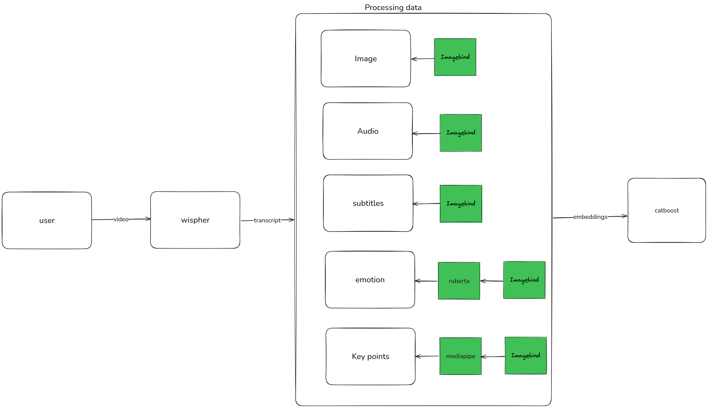

## Inference pipline



## Jupyter
- Советы кандидатам: [comment.ipynb](ml/jupyters/comment.ipynb)
- Тренировка модели [train.ipynb](ml/jupyters/train.ipynb)
- Генерация датасета [dataset.ipynb](ml/jupyters/dataset.ipynb)

## Как запустить
### 1. Клонирование репозитория

Для начала клонируйте репозиторий на вашу локальную машину:

```bash
git https://github.com/Hackathon-Hitchhiking/International-CP-Hack-2024.git
cd International-CP-Hack-2024
```

### 2. Создание и настройка файла окружения для Docker

Скопируйте пример файла окружения `.docker/.env.example` в `.docker/.env` и заполните необходимые переменные:

```bash
cp .docker/.env.example .docker/.env
nano .docker/.env
```

### 3. Создание и настройка файла конфигурации

Аналогично, скопируйте пример файла конфигурации `configs/.env.example` в `configs/.env` и укажите соответствующие переменные:

```bash
cp configs/.env.example configs/.env
nano configs/.env
```

### 4. Запуск Docker Compose

После настройки всех конфигурационных файлов запустите Docker Compose для сборки и запуска контейнеров:

```bash
docker compose up --build
```

Убедитесь, что все переменные окружения и конфигурационные файлы корректно настроены перед запуском команд. 